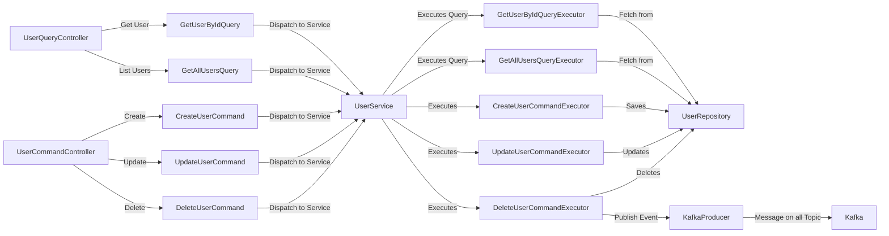
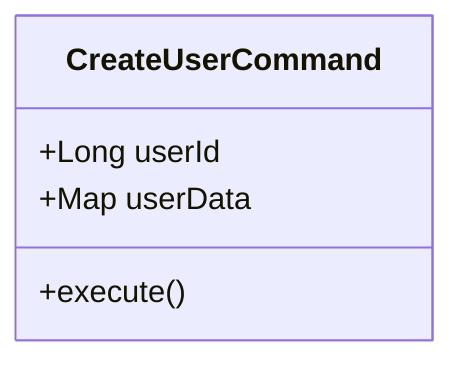
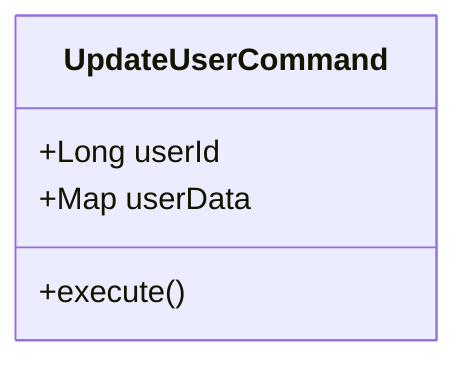
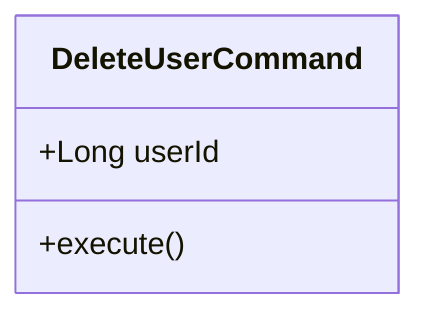
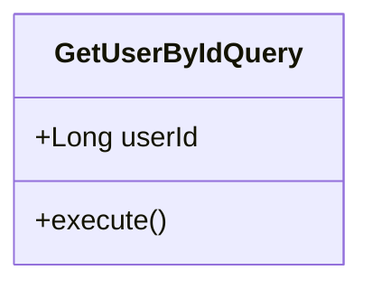
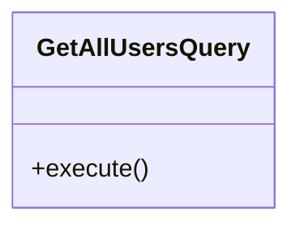
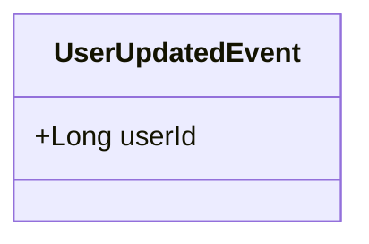
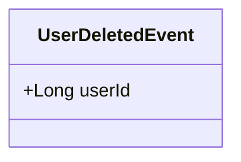

# User Service

## Overview

The User Service is a robust Spring Boot application designed to manage user information efficiently. It utilizes an event-driven design pattern to enhance decoupling, scalability, and maintainability of components.

## Event-Driven Design Pattern

This service uses an event-driven architecture to enable asynchronous communication and decouple service components. Events are generated following the execution of commands and handled independently by other parts of the application.

## Project Structure

- `api`: Core API interfaces.
- `command`: Classes encapsulating command details.
- `controller`: REST controllers managing HTTP requests.
- `event`: Event classes representing system actions.
- `executors`: Business logic processors for commands.
- `kafka`: Kafka message producers and consumers.
- `model`: Business entity data models.
- `query`: Data retrieval operations.
- `repo`: Database interaction.
- `service`: Business logic and service layer.

## Process Flow Diagram



## Commands

### CreateUserCommand

- **Purpose**: Initiates the creation of a new user.
- **Details**: Carries user data required for creating a new user record.
- **Executor**: Handled by `CreateUserCommandExecutor` which adds the user to the database.



### UpdateUserCommand

- **Purpose**: Updates an existing user's details.
- **Details**: Contains user ID and new data such as email or username.
- **Executor**: `UpdateUserCommandExecutor` updates the user's details in the database.



### DeleteUserCommand

- **Purpose**: Removes a user from the system.
- **Details**: Includes the ID of the user to be deleted.
- **Executor**: `DeleteUserCommandExecutor` removes the user from the database and triggers a `UserDeletedEvent`.



## Queries

### GetUserByIdQuery

- **Purpose**: Retrieves detailed information about a specific user.
- **Details**: Carries the unique ID of the user.
- **Executor**: `GetUserByIdQueryExecutor` fetches user details from the database.



### GetAllUsersQuery

- **Purpose**: Retrieves a list of all users in the system.
- **Details**: Does not require specific input parameters.
- **Executor**: `GetAllUsersQueryExecutor` fetches all users from the database.



## Events

### UserCreatedEvent

- **Triggered by**: Successful execution of `CreateUserCommand`.
- **Purpose**: Indicates that a new user has been added to the system.


### UserUpdatedEvent

- **Triggered by**: Successful execution of `UpdateUserCommand`.
- **Purpose**: Indicates that a user's details have been updated.



### UserDeletedEvent

- **Triggered by**: Successful execution of `DeleteUserCommand`.
- **Purpose**: Indicates that a user has been removed from the system.



## Getting Started

To run the service locally:

1. **Clone the repository**:
   ```bash
   git clone https://github.com/your-repo/user-service.git
   ```

2. **Build the application**:
   ```bash
   ./mvnw clean install
   ```

3. **Start the application**:
   ```bash
   ./mvnw spring-boot:run
   ```

4. **Access the application** at `http://localhost:8080`.

## Swagger Endpoint

Access the Swagger UI to interact with the API:

- **URL**: `http://localhost:8080/swagger-ui.html`


