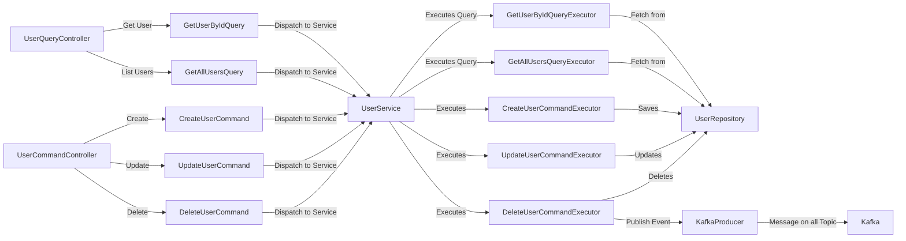
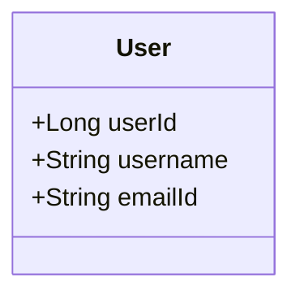
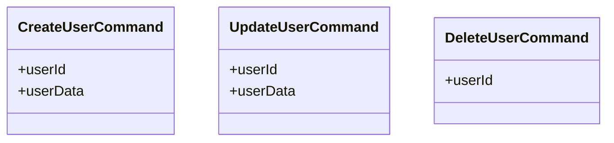
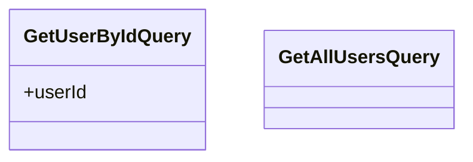
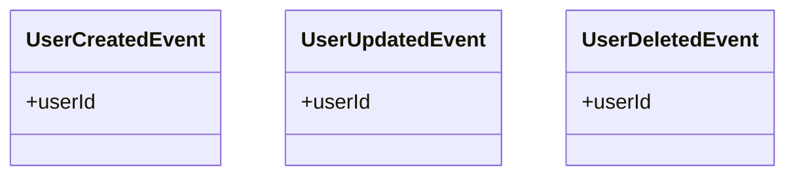

# User Service

## Overview

The User Service is a robust Spring Boot application designed to manage user information efficiently. It utilizes an event-driven design pattern to enhance decoupling, scalability, and maintainability of components.

## Event-Driven Design Pattern

This service uses an event-driven architecture to enable asynchronous communication and decouple service components. Events are generated following the execution of commands and handled independently by other parts of the application.

## Project Structure

- `api`: Core API interfaces.
- `command`: Classes encapsulating command details.
- `controller`: REST controllers managing HTTP requests.
- `event`: Event classes representing system actions.
- `executors`: Business logic processors for commands.
- `kafka`: Kafka message producers and consumers.
- `model`: Business entity data models.
- `query`: Data retrieval operations.
- `repo`: Database interaction.
- `service`: Business logic and service layer.

## Process Flow Diagram



## Entity Class Diagram



## Command, Query, and Event Class Diagrams

### Commands



### Queries



### Events



## Swagger Endpoint

Access the Swagger UI to interact with the API:

- **URL**: `http://localhost:8080/swagger-ui.html`

## Database Entity

The `User` is modeled as follows:

```java
@Entity
@Table(name = "users")
public class User {
    @Id
    @GeneratedValue(strategy = GenerationType.IDENTITY)
    private Long userId;
    
    @Column(nullable = false)
    private String username;
    
    @Column(unique = true, nullable = false)
    private String emailId;
}
```

## Getting Started

To run the service locally:

1. **Clone the repository**:
   ```bash
   git clone https://github.com/your-repo/user-service.git
   ```

2. **Build the application**:
   ```bash
   ./mvnw clean install
   ```

3. **Start the application**:
   ```bash
   ./mvnw spring-boot:run
   ```

4. **Access the application** at `http://localhost:8080`.

## Contributions

Contributions are welcome! Please fork the repository, make your changes, and submit a pull request.

## License

Licensed under the MIT License. See the LICENSE file for more details.
